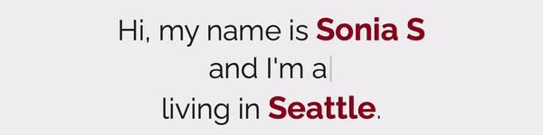

## Tech Stack

## Blogs

- 👋 Hi, I’m Sonia!
- Working as Associate Software Engineer in Test at Wellframe in Boston, USA 
- 👀 I’m interested in ...
- 🌱 I’m currently learning ...
- 💞️ I’m looking to collaborate on social impact projects
- 📫 How to reach me: srsonia98@yahoo.com.sg

<!---
srsonia2506/srsonia2506 is a ✨ special ✨ repository because its `README.md` (this file) appears on your GitHub profile.
You can click the Preview link to take a look at your changes.

--->

